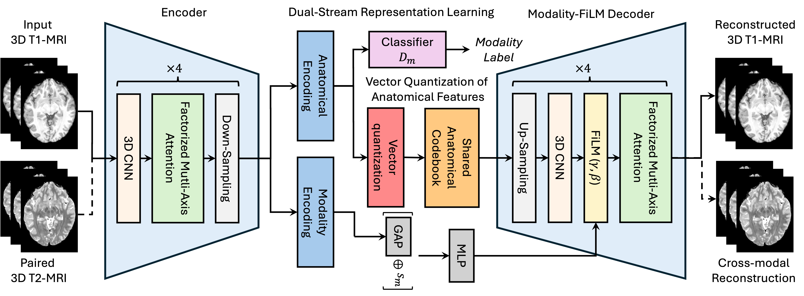

# NeuroQuant

**Modality-Aware and Anatomical Vector-Quantized Autoencoding for Multimodal Brain MRI**

> CVPR 2026 (Findings) — Li, Kim, Zhao, Adeli, Pohl

NeuroQuant is a unified **dual-stream 3D VQ-VAE** for multimodal brain MRI. It disentangles
anatomical structure from modality-specific contrast by quantizing only the anatomical
stream against a shared codebook, while modulating the decoder with FiLM parameters
predicted from the modality stream. A factorized multi-axis attention encoder keeps the
3D self-attention cost tractable, and a 2D/3D joint training scheme lets the model learn
coherently from both volumes and planar slices.

<p align="center">
  
</p>

---

## Key components

| Module | File | Description |
|---|---|---|
| Factorized multi-axis attention | [`blocks.py`](blocks.py) | 3D attention decomposed into axial / coronal / sagittal axes — `O(DHW · (D+H+W))` instead of `O((DHW)²)`. |
| Dual-stream encoder | [`model.py`](model.py) | Shared backbone → two lightweight conv heads producing `z_anat` and `z_mod`. |
| Anatomical codebook (EMA-VQ) | [`quantizer.py`](quantizer.py) | EMA-updated VQ with k-means cold start (reservoir-based) and adaptive dead-code revival. |
| FiLM decoder | [`model.py`](model.py) | Quantized `z_anat` decoded with per-stage `(γ, β)` modulation predicted from `concat(GAP(z_mod), s_m)`. |
| Modality adversary (GRL) | [`model.py`](model.py) | Gradient-reversed classifier on `z_anat` enforcing modality invariance (auxiliary, very low weight). |
| Cross-modal swap loss | [`train.py`](train.py) | Reconstruct `T2` from `(z_anat^{T1}, FiLM^{T2})` and vice-versa. |
| 2D/3D joint training | [`train.py`](train.py) | With probability `prob_2d` each step, an extra paired-slice mini-batch is processed. |

---

## Repository layout

```
NeuroQuant/
├── __init__.py
├── blocks.py        # Building blocks: factored conv, multi-axis attention, perceptual loss
├── quantizer.py     # EMA Vector Quantizer + reservoir cold start + adaptive revival
├── model.py         # Dual-stream encoder, FiLM decoder, GRL classifier, NeuroQuant + losses
├── dataset.py       # PairedBrainMRI3DDataset (T1w + T2w paired by subject directory)
├── metrics.py       # PSNR / SSIM (whole-volume + foreground-only)
├── train.py         # Accelerate-based training loop with warmup schedules
├── config.yaml      # Default training config
├── network.png      # Architecture figure
└── README.md
```

NeuroQuant has **zero external repo dependencies** — every building block lives inside
this folder.

---

## Requirements

Tested on Python 3.9, CUDA 12.x, PyTorch 2.1+.

```text
torch>=2.1.0
torchvision>=0.16.0
nibabel>=5.0.0
numpy>=1.24.0
einops>=0.7.0
accelerate>=0.25.0
wandb>=0.16.0
pyyaml>=6.0
```

Install:
```bash
pip install torch torchvision nibabel numpy einops accelerate wandb pyyaml
```

Hardware: training was developed on **4× NVIDIA H100 80GB**. With the default config
(`target_shape: [144, 192, 144]`, `batch_size: 4` paired, gradient checkpointing on),
each H100 holds ~50 GB.

---

## Data format

NeuroQuant expects each subject to provide a **paired T1w + T2w** volume in the same
directory. The dataset loader (`dataset.py::discover_files`) uses glob patterns to
find them. Out-of-the-box patterns are provided for:

- **ABCD** — `ABCD/processed/Structural/registration/Unzip/*/ses-*/anat/T{1,2}w_mni_warped_n4.nii.gz`
- **HCP-Aging** / **HCP-Development** / **HCP-YA**
- **NCANDA** — `NCANDA/NCANDA_S*/*/t{1,2}_brain.nii.gz`

To add a new dataset, add an entry to `DATASET_PATTERNS` in [`dataset.py`](dataset.py):

```python
DATASET_PATTERNS = {
    "MyCohort": {
        "T1w": "MyCohort/sub-*/anat/T1w.nii.gz",
        "T2w": "MyCohort/sub-*/anat/T2w.nii.gz",
    },
    ...
}
```

The loader pairs T1w/T2w files by their **parent directory**: any pair of files whose
parent paths match and which come from the same dataset will be treated as one paired
subject. Subjects lacking either modality are automatically dropped.

### Pre-processing assumed

- Volumes are stored as NIfTI (`.nii` / `.nii.gz`).
- Volumes are skull-stripped (background ≈ 0); MNI registration is recommended but not
  strictly required — the loader center-crops/pads to `target_shape`.
- Intensities are normalized **on the fly** by per-volume brain-masked percentile
  clipping → `[-1, 1]` (`normalize_brain_volume` in `dataset.py`). No global statistics
  file is needed.

> ⚠️ The cross-modal swap loss assumes T1 and T2 of the same subject are
> **voxel-aligned**. Datasets where T1/T2 are not co-registered should be co-registered
> beforehand, otherwise the model will learn the misalignment as "contrast".

---

## Configuration

All hyperparameters live in [`config.yaml`](config.yaml). The most relevant knobs:

```yaml
data:
  data_root: "/path/to/your/datasets"
  datasets: ["ABCD", "NCANDA"]
  target_shape: [144, 192, 144]    # 16x downsample → 9×12×9 = 972 latent tokens

model:
  base_channels: 64
  channel_multipliers: [1, 2, 4, 4]   # 4 stages → 16x spatial down
  anat_channels: 64                    # codebook embedding dim
  mod_channels: 32
  codebook_size: 4096                  # K_a

training:
  batch_size: 4
  learning_rate: 4.5e-5
  ssim_weight: 0.5
  vq_weight: 1.0
  cross_weight: 0.5                    
  adv_weight: 0.001                    
  cross_start_step: 2000               
  adv_start_step: 5000                 
  joint_2d3d: true
  prob_2d: 0.3


---

## Running

### Single GPU

```bash
accelerate launch --num_processes 1 -m NeuroQuant.train \
    --config NeuroQuant/config.yaml
```

### Multi-GPU (e.g. 4× H100)

```bash
accelerate launch --num_processes 4 --multi_gpu -m NeuroQuant.train \
    --config NeuroQuant/config.yaml
```

### Resume from a checkpoint

```bash
accelerate launch --num_processes 4 --multi_gpu -m NeuroQuant.train \
    --config NeuroQuant/config.yaml \
    --resume checkpoints/neuroquant/neuroquant_step0050000.pt
```

Set `checkpoint.resume_mode: "full"` in the config to also restore the optimizer /
scheduler / global step. The default `"weights_only"` mode loads model + EMA only and
restarts optimization fresh — safer when changing GPU count.

### Outputs

- **Checkpoints** are written to `checkpoint.output_dir` (default `checkpoints/neuroquant/`).
  - `neuroquant_step{N}.pt` — periodic snapshots
  - `neuroquant_best.pt` — lowest validation loss
  - `neuroquant_final.pt` — end of training
- **Logging** goes to **Weights & Biases** under the project specified in `wandb.project`.
  Set `WANDB_MODE=offline` to disable online logging.


## Citation

If you find this work useful, please cite:

```bibtex
@article{li2026modality,
  title={Modality-Aware and Anatomical Vector-Quantized Autoencoding for Multimodal Brain MRI},
  author={Li, Mingjie and Kim, Edward and Zhao, Yue and Adeli, Ehsan and Pohl, Kilian M},
  journal={arXiv preprint arXiv:2604.05171},
  year={2026}
}
```